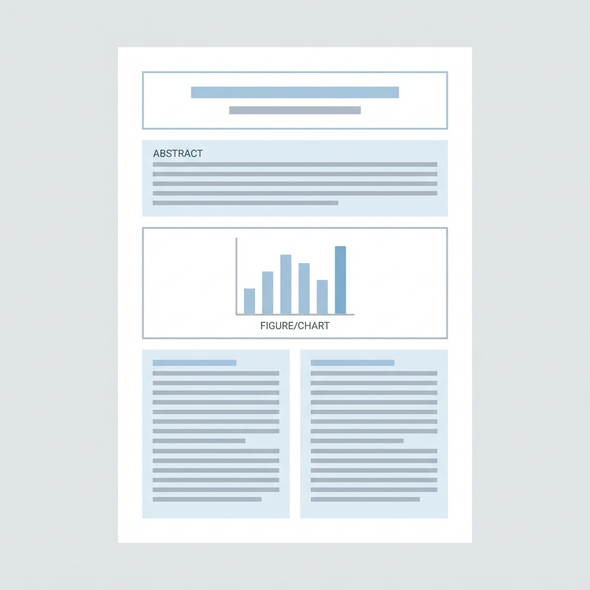
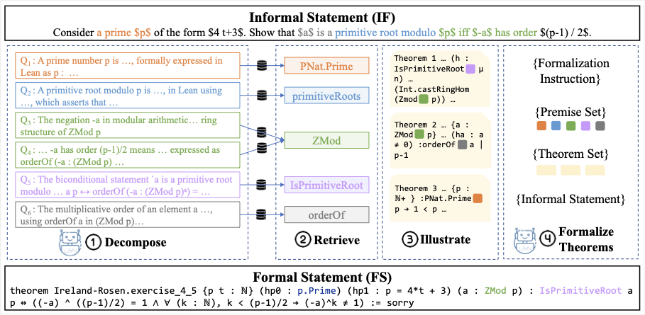
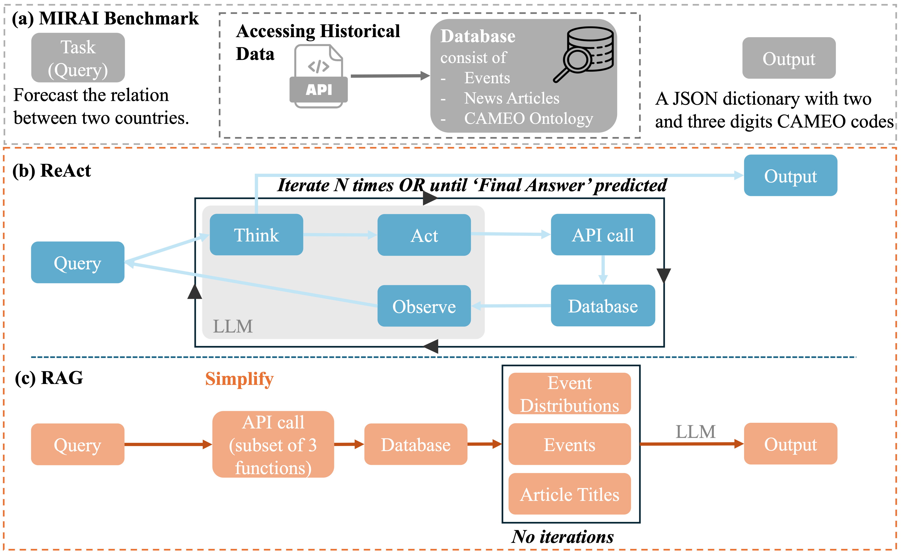
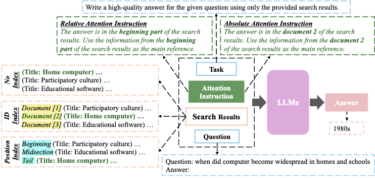
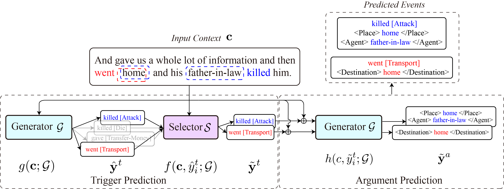

<!-- Each paper uses HTML divs with CSS classes defined in quartz/styles/custom.scss -->
<!-- To add a paper: copy a pub-entry block, update the text, and add your figure to images/ -->
<!-- Available venue badges: venue-arxiv, venue-iclr, venue-acl, venue-emnlp, venue-findings, venue-workshop, venue-aaai, venue-neurips, venue-icml, venue-naacl, venue-coling, venue-eacl, venue-thesis -->

ACL 2026

<strong>Failure Modes in Multi-Hop QA: The Weakest Link Effect and Recognition Bottleneck</strong>

Meiru Zhang, Zaiqiao Meng, Nigel Collier

ACL 2026

<a href="https://arxiv.org/abs/2601.12499">PDF</a>

Abstract

Multi-hop QA fails in long contexts due to position bias. We propose Multi-Focus Attention Instruction (MFAI) and evaluate 5 LLMs on MuSiQue and NeoQA, identifying recognition failure as the main bottleneck and proposing the "Weakest Link Effect".

ICLR 2026

<strong>DRIFT: Decompose, Retrieve, Illustrate, then Formalize Theorems</strong>

Meiru Zhang, Philipp Borchert, Milan Gritta, Gerasimos Lampouras

International Conference on Learning Representations (ICLR), 2026

<a href="https://arxiv.org/abs/2510.10815">PDF</a>

Abstract

DRIFT is a retrieval-augmented autoformalization pipeline that decomposes queries, retrieves premises and illustrative examples, and achieves significant improvements over baselines on theorem formalization tasks.

ACL 2025

<strong>The Power of Simplicity in LLM-Based Event Forecasting</strong>

Meiru Zhang, Auss Abbood, Zaiqiao Meng, Nigel Collier

First Workshop for Research on Agent Language Models (REALM), ACL 2025

<a href="https://aclanthology.org/2025.realm-1.32/">PDF</a>

Abstract

We replace multi-step agentic reasoning (e.g., ReAct) with a single-step RAG pipeline and show that structured evidence beats raw headlines at ~10% of ReAct inference cost for event forecasting.

EMNLP 2024

<strong>Can We Instruct LLMs to Compensate for Position Bias?</strong>

Meiru Zhang, Zaiqiao Meng, Nigel Collier

Findings of EMNLP, 2024

<a href="https://aclanthology.org/2024.findings-emnlp.732/">PDF</a>

Abstract

We propose Attention Instruction to steer LLM attention and improve controllability by reweighting attention to target prompt regions, compensating for position bias in in-context learning.

ACL 2023

<strong>COFFEE: A Contrastive Oracle-Free Framework for Event Extraction</strong>

Meiru Zhang, Yixuan Su, Zaiqiao Meng, Zihao Fu, Nigel Collier

First Workshop on Matching From Unstructured and Structured Data (MATCHING), ACL 2023

<a href="https://aclanthology.org/2023.matching-1.4/">PDF</a>

Abstract

We introduce the Oracle-Free Event Extraction (OFEE) setting and develop the COFFEE framework, enabling event extraction without oracle triggers and providing a stronger, more realistic evaluation protocol.

ICMI 2019

<strong>Multi-modal Active Learning From Human Data: A Deep Reinforcement Learning Approach</strong>

Ognjen Rudovic, Meiru Zhang, Bjorn Schuller, Rosalind Picard

International Conference on Multimodal Interaction (ICMI), 2019

<a href="https://doi.org/10.1145/3340555.3353742">PDF</a>

Abstract

We build multimodal user-state models and implement a DQN-based active learning agent to select the most informative samples for labeling, reducing annotation waste for multi-class classification.

